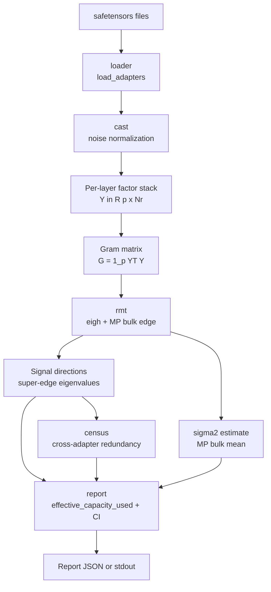

# adapterfax

[](https://github.com/hinanohart/adapterfax/actions/workflows/ci.yml)


**Data-free, CPU, post-hoc audit of a stack of continual-learning LoRA / DoRA / (IA)³ adapters.**

adapterfax reads only the adapter weight files (no training data, no forward pass, no labels) and reports two things: how many independent signal directions the accumulated adapter stack actually spans above a Marchenko–Pastur noise floor (the "effective capacity used"), and which subsets of adapters share those directions and are therefore candidates for redundancy. It is a **measurement instrument, not an optimizer** — it makes no downstream accuracy claim.

> Status: **v0.1.0a1 (alpha).** All headline numbers are from synthetic experiments with planted ground-truth. See [Validation](#validation).

---

## Architecture overview



---

## Why this exists

When you keep stacking task adapters during continual learning, two questions have no cheap, data-free answer:

1. **How much of the stack is real signal vs. accumulated noise?**
2. **Which adapters are redundant with each other** (carry the same direction)?

adapterfax answers both from the weights alone, on CPU, in seconds.

## Quickstart

```bash
pip install adapterfax                 # numpy + safetensors only
pip install "adapterfax[tw]"           # + scipy, sharper Tracy-Widom cross-check
```

**CLI:**

```bash
adapterfax audit task1.safetensors task2.safetensors task3.safetensors --json
adapterfax gate                        # run the synthetic sensitivity gates
```

**Python API:**

```python
import adapterfax

adapters = adapterfax.load_adapters(["task1.safetensors", "task2.safetensors"])
report = adapterfax.audit(adapters)

print(report.effective_capacity_used, report.effective_capacity_ci)

for circuit in report.dependency_census:   # candidate redundant subsets
    print(circuit.members, circuit.margin)
```

Core is **torch-free, CPU-only**, Python 3.10–3.13.

---

## How it works

Per layer, given the factor stack `Y = [(α/r)·B_i]_i ∈ ℝ^{p×Σr}` (the stacked low-rank factors; `ΔW` is never materialized):

1. **Noise normalization** — robust per-adapter scaling keeps the stack homoscedastic.
2. **Gram matrix** — `G = (1/p) Yᵀ Y` and `eigh(G)` (never a wide SVD of the full `p×m` stack).
3. **Noise floor** — `σ̂²` estimated from the Marchenko–Pastur bulk mean.
4. **Calibrated edge** — a parametric-null bootstrap of the pivotal quantity `λ_max/σ̂²` controls type-I error at the 5% level.
5. **Effective capacity** — count of eigenvalues above the edge, plus a bootstrap confidence interval.
6. **Redundancy census** — a tolerance-based scan of the signal subspace identifies cross-adapter shared directions (candidates the per-adapter PARA baseline cannot see).

The two donor ideas and where the novelty lies:

| Donor field | What it gives | What adapterfax adds |
|---|---|---|
| **Random Matrix Theory** (Marchenko–Pastur, BBP spike) | principled noise floor and signal test | applies it to the **adapter-set stack spectrum** with a calibrated, finite-sample noise edge |
| **Combinatorial dependency** | language for "which subset is redundant" | a **cross-adapter inclusion census** that per-adapter rank pruning cannot express |

The surviving novelty is the intersection: adapter-SET stack spectrum × MP/BBP noise floor × SET-level redundancy × data-free post-hoc. Each property alone is prior art.

---

## Prior art

adapterfax does **not** subsume any of these; it occupies the gap between them.

- **WeightWatcher** — RMT spectral metrics (`num_spikes`) on single weight matrices.
- **Spectrum** (arXiv:2406.06623) — per-layer MP signal-to-noise on single matrices.
- **PARA** (arXiv:2604.27796) — data-free, post-hoc global-SVD rank pruning. Reports a per-adapter retained rank; no notion of cross-adapter shared subsets.
- **Spectral Surgery** (arXiv:2603.03995) — training-free SVD reweighting, data-dependent.
- **erank / TIES / DARE** — effective rank and merge baselines (all shipped alongside).
- **scikit-rmt** — RMT distribution objects (not used here; adapterfax is numpy-native).

`marchenko-pastur` on a single matrix is mature (Gavish–Donoho 2014, Johnstone 2001). The wedge is the adapter-set framing plus the redundancy census.

---

## Validation

All numbers come from synthetic experiments with planted ground-truth; they characterize the instrument under known conditions and do **not** claim accuracy improvements or fidelity on real adapter stacks.

**Synthetic plant validation** (seed 20260609; 1000 null trials; `results/v0.1.0a1_metrics.json`):

| Quantity | Result |
|---|---|
| BBP supercritical spike recovery (TPR) | 1.00 (95% CI [1.00, 1.00]) |
| Null type-I FPR, γ=0.25 (800×200) | 0.043 (95% CI hi 0.057) |
| Null type-I FPR, γ=0.50 (400×200) | 0.042 (95% CI hi 0.056) |
| Effective-rank calibration (estimated vs planted) | 2 vs 2 (err 0) |
| σ̂² recovery (true 0.5) | 0.504 |
| MP bulk goodness-of-fit (KS p) | 1.00 |

**Cross-adapter redundancy the per-adapter baselines miss:** with planted shared directions across adapters {0,1,2} and {3,4}, the census recovers those two subsets, while PARA returns only a per-adapter rank (4 each) and never names a subset — this is the gap that justifies the census output (gate G9).

All nine gates pass with `active_mode=full`.

**Pre-registered sensitivity gates** (run `adapterfax gate --full`):

| Gate | Checks |
|---|---|
| G1 | supercritical spike recovery TPR >= 0.95 |
| G2 | null type-I FPR <= 0.05 |
| G3 | estimated effective rank = planted ±1 |
| G4 | estimator (bulk-mean vs median) consistency |
| G5 | determinism (byte-identical) |
| G6 | census finds cross-adapter redundancy PARA misses |
| G7 | scale invariance |
| G8 | type-I control at a second aspect ratio |
| G9 | end-to-end determinism |

---

## Limitations (NON-CLAIMS)

1. The census is an **approximate dependency census** (RMT-tolerance-dependent), not an exact one — it is *not* a matroid. The matroid axioms hold only on the RMT-denoised exact reconstruction, not on the tolerance relation; that exact variant is an experimental extra and not exposed in v0.1.
2. The MP/BBP thresholds are isotropic-iid approximations with **no calibration guarantee** for structured rank-r LoRA delta. They are validated on synthetic plants and a robust noise normalization, not proven for arbitrary real stacks.
3. Effective capacity used is a weight-space quantity with **no downstream accuracy claim**. A redundant subset is a candidate for inspection, not a proven safe drop.

Interference detection is **not** claimed in v0.1: a `Circuit` is `redundant` only; sign reading is gauge-dependent and not validated. Scope is **tens** of adapters.

The three non-claims, verbatim (canonical source: `adapterfax._noclaim.NON_CLAIMS`, CI-grepped):

> 1. the census is an approximate dependency census (RMT-tolerance-dependent), not an exact one
> 2. MP/BBP thresholds are isotropic-iid approximations with no calibration guarantee for structured rank-r LoRA delta
> 3. effective capacity used is a weight-space quantity; no downstream accuracy claim

---

## License

MIT.
